# Postman: What you need to know for your project

## Getting Started

* [Postman tutorial](https://www.guru99.com/postman-tutorial.html)
* [Postman docs](https://learning.postman.com/docs/getting-started/sending-the-first-request/)

## Free Online HTTP Test Services (to play around)

* [JSONPlaceholder](https://jsonplaceholder.typicode.com/)
* [Postman Echo](https://docs.postman-echo.com/)

## Import a Test Collection

1. File > Import ...

    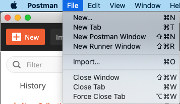

2. Choose file [tests/server.postman_collection.json](../tests/server.postman_collection.json)

    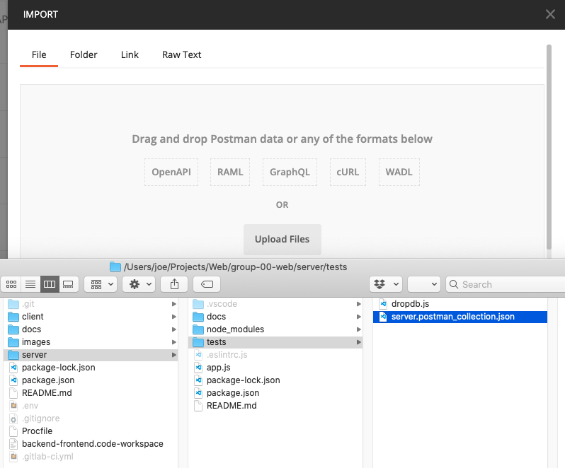

## Run a Test Collection

1. Create a new empty environment in Postman in the top right corner via `Add`

    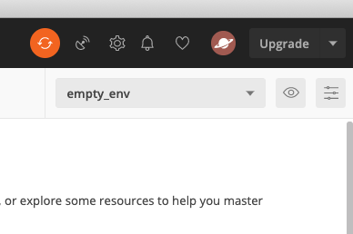

2. Start your backend server in the terminal via `npm run dev`
3. Run the collection

    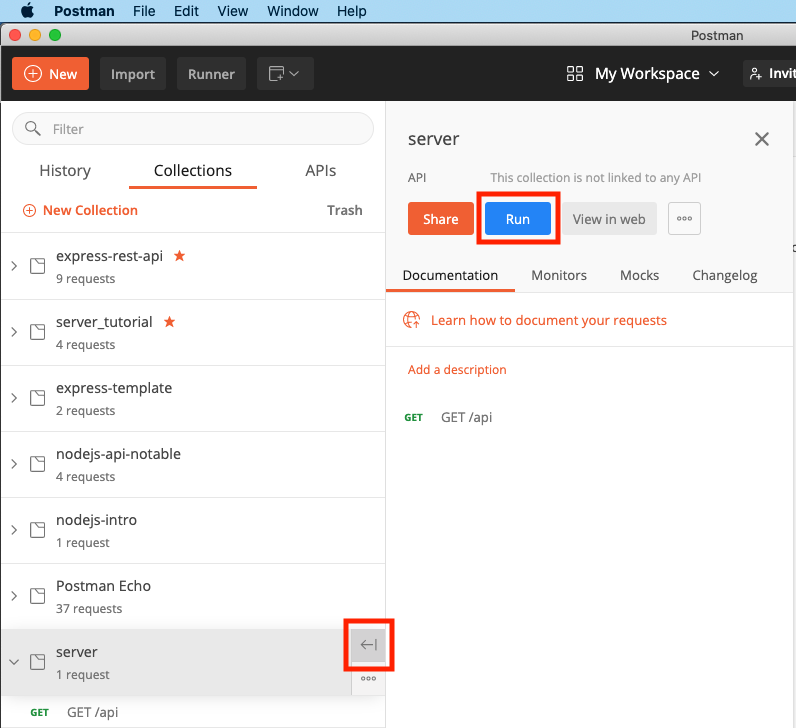

4. Select your empty environment and click `Run server`

    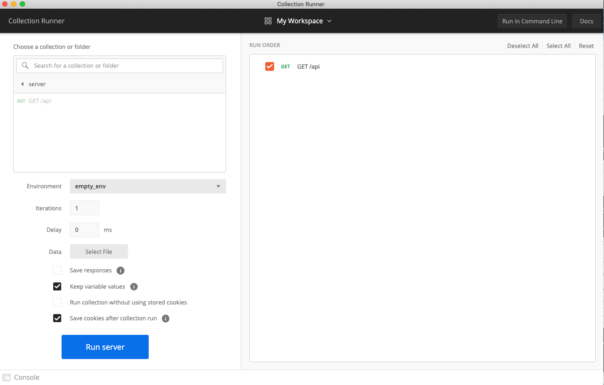

## Export Test Collection

1. In the extended menu `...` of your collection, click `Export`

    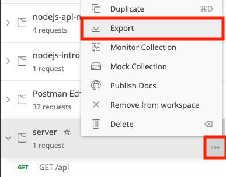

2. Choose the latest export format (v2.1)

    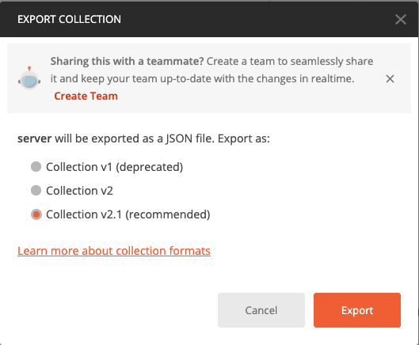

3. *Overwrite* the file [tests/server.postman_collection.json](../tests/server.postman_collection.json)

    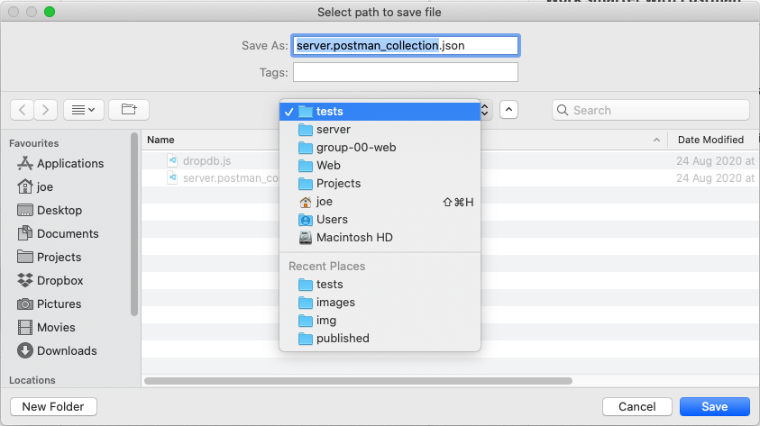

4. Run `npm test` in your terminal

    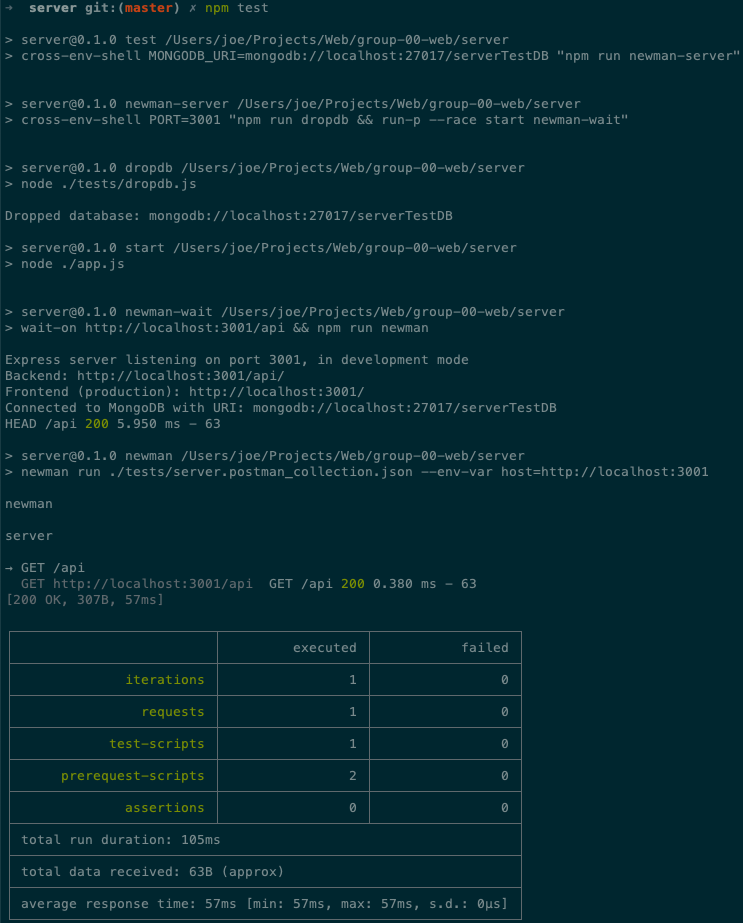

## Test script assertions

* [Test script examples](https://learning.postman.com/docs/writing-scripts/script-references/test-examples/)

## Chaining Requests via Postman Variables

> Make sure your test collection works on an empty database!

Whenever you create an object that you want to use later (e.g., to retrieve, update, delete), you need to save its `_id` to a Postman environment variable for later re-use:

1. Save the `_id` of created objects for later request via `pm.environment.set("camel_id", jsonData._id);`

    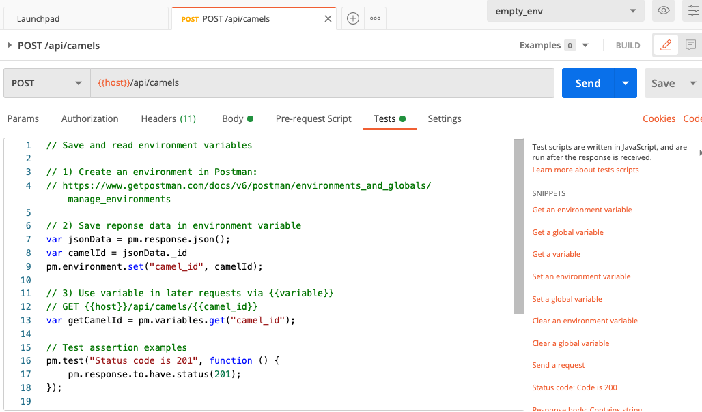

2. Use variables in *later* requests in Postman via `{{camel_id}}` or in Postman scripts or via `pm.variables.get("camel_id");`

    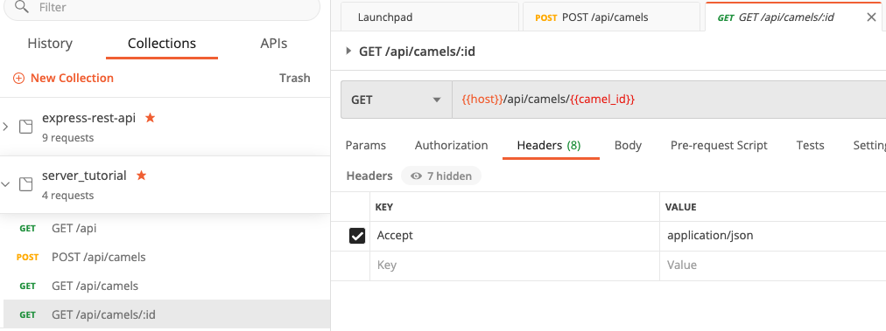

Check out the following documentation for more info:

* [Extracting data from responses and chaining requests](http://blog.getpostman.com/2014/01/27/extracting-data-from-responses-and-chaining-requests/)
  * NOTE: Uses the deprecated environment variable syntax. Replace `postman.setEnvironmentVariable(...)` with `pm.environment.set(...)`
* [Example in the express-rest-api tutorial used in the lecture](https://git.chalmers.se/courses/dit341/express-rest-api)
* [Postman detailed docs about variables](https://learning.postman.com/docs/sending-requests/variables/)
